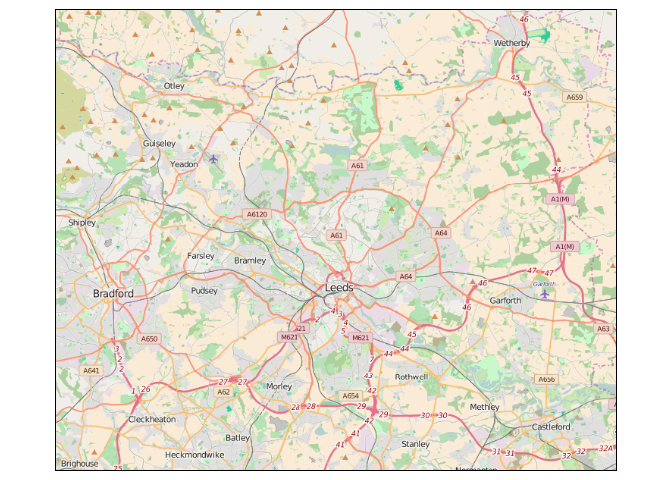

# Leeds R User Group

To illustrate badges, I've taken ones from the **stplanr** package.

[](https://travis-ci.org/ropensci/stplanr) [](http://cran.r-project.org/package=stplanr)
[](https://github.com/metacran/cranlogs.app)

This is a test repo for Leeds R Users group.

# Homework

## Part 1: Background reading and exploring.

As a bit of context please have a browse around the Propensity to Cycle Tool GitHub team, which is a space for 6+ academics from different universities to develop this product that will go national in July:

- Propensity to Cycle Tool GitHub team: https://github.com/npct/

- Academic paper on it for context: http://arxiv.org/abs/1509.04425

Hopefully that this shows that GitHub is a useful way to organise large code-heavy projects.

Now please also have a look at some R User Groups who organise their stuff via GitHub:

- Article on it: http://www.r-bloggers.com/r-user-groups-on-github/

- List of GitHub R User Group projects: https://www.google.co.uk/search?q=site:github.com+R+user+group

## Part 2: Contribute to the Leeds R Users Group

The involves 3 things:

1) Sign up to GitHub, as described here:
https://github.com/join

2) Fork the repo onto your account as described here:
https://help.github.com/articles/fork-a-repo/

3) Make some changes, push them and make a pull request to https://github.com/Leeds-Rug/test-repo :
https://help.github.com/articles/using-pull-requests/


Specifically, try to add a line of working R code to the script here and add your name to the comment:
https://github.com/Leeds-Rug/test-repo/blob/master/test.R


The aim: to modify the [`test.R`](https://github.com/Leeds-Rug/test-repo/blob/master/test.R) script with a [Pull Request](https://help.github.com/articles/using-pull-requests/).

If you make a pull request, you'll be added to this 'team'. From there you can create new team repos like this one and push directly to them (although Pull Requests are usually recommended).

## Part 3: example R code


```r
library(tmap)
b <- bb("Leeds")
tm_tiles <- read_osm(b)
tm_shape(tm_tiles) +
  tm_raster()
```



## Part 4: Useful resources

- @visser_speeding_2015 provides an excellent overview of making your R code faster
- @Wickham_2015 demonstrates how to build R packages, easily

## References

